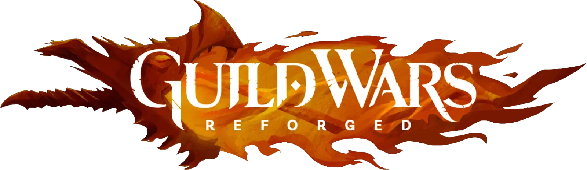

<p align="center">
  
</p>

<h1 align="center">gwonmac</h1>

<p align="center">
  <strong>Guild Wars Reforged for macOS, Windows, and Linux</strong><br>
  Run ArenaNet's official Guild Wars client through one profile-based desktop launcher.
</p>

<p align="center">
  <a href="https://www.gwonmac.com/">Website</a> ·
  <a href="https://www.gwonmac.com/download">Download</a> ·
  <a href="docs/user-guide.md">User guide</a> ·
  <a href="https://discord.gg/Z9ft52RBD3">Discord</a> ·
  <a href="https://github.com/Mat4m0/gwonmac/issues/new?template=bug-report.yml">Report a bug</a> ·
  <a href="https://github.com/Mat4m0/gwonmac/issues/new?template=feature-request.yml">Request a feature</a>
</p>

> [!CAUTION]
> **This is an unofficial client host.**
> ArenaNet and NCSOFT do not make, sponsor, endorse, or support gwonmac.

## What gwonmac does

gwonmac hosts ArenaNet's official WebAssembly client in a sandboxed desktop
application. Windows and Linux run the client natively; macOS does not need
Wine, a virtual machine, or CrossOver.

The app provides:

- native Apple Silicon, Windows x64, and Linux x86_64 packaging;
- high-resolution rendering;
- platform-native package verification and saved-login storage;
- verified downloads from ArenaNet;
- ArenaNet and Steam sign-in;
- optional Build Management, Quick Travel, and Xunlai Storage Tools;

## Requirements

- Apple Silicon macOS, Windows x64, or Linux x86_64 with Flatpak.
- A Guild Wars account.
- An internet connection for the first download and online play.

You can buy Guild Wars from the [official store](https://store.guildwars.com/en-us).

## Install

1. Open the [Releases page](https://github.com/Mat4m0/gwonmac/releases) or go to https://gwonmac.com/download.
2. Choose the package published for your platform: macOS DMG, Windows Setup,
   or the Linux Flatpak repository instructions.
3. Install it through the normal system installer or Flatpak software center.
4. Open **Guild Wars Reforged**.

Published Stable packages use the platform's verification path: Developer ID
and Apple notarization, Windows Authenticode, or a signed Flatpak repository.
Release availability can differ by platform while qualification is in progress.
The Releases page also provides checksums, an SBOM, and build attestations. See
[Verify a release](docs/release-verification.md) for the exact checks.

## Start the game

Guild Wars starts as soon as the required data is ready, then downloads the
rest of the game in the background while you play. You can see progress or
pause the download in **Settings → Game files**. The
[user guide](docs/user-guide.md) explains sign-in, updates, Tools, recovery,
and local data.

## Privacy and safety

- The app sends no gwonmac telemetry.
- Diagnostics stay on your device until you attach an export to a report.
- The diagnostics system does not record credentials, packet contents,
  cookies, request bodies, or local paths.
- Provisioned builds can store saved login in Apple's device-only Data
  Protection Keychain.
- The app verifies downloaded client artifacts before use.
- The app keeps the untouched official client as the fallback.

ArenaNet and login providers still receive the traffic that the game needs.
See [Security](SECURITY.md) and [Diagnostics](docs/diagnostics.md) for the exact
boundaries.

## Application updates

Stable is the default update track. You can choose Beta in Settings. Stable,
Beta, and release-candidate builds use the same app identity and local profile.
Alpha builds are not public update candidates.

Application updates never block Play. The launcher offers a restart after an
update is ready, so running game windows remain under the player's control.
The app never performs an automatic downgrade.

Application updates and ArenaNet game updates are separate systems. See the
[user guide](docs/user-guide.md#updates) for player instructions.

## Build from source

You need Node.js 22.19 or newer, pnpm 11, Rust through rustup, and the native
compiler toolchain for the target platform. macOS builds require Apple Silicon
and Xcode Command Line Tools; Windows builds require x64 MSVC; Linux builds
require the x86_64 GLib development headers. The supported commands and exact
CI toolchains are in the [development workflow](docs/development-workflow.md).

```bash
corepack enable
pnpm install --frozen-lockfile
pnpm exec playwright install chromium
pnpm dev
```

Use `pnpm run check` for the fast source gate. Use `pnpm verify` before a pull
request. The complete contributor setup is in [CONTRIBUTING.md](CONTRIBUTING.md).

## Documentation

- [User guide](docs/user-guide.md) — install, play, update, recover, and report.
- [Technical documentation](docs/README.md) — architecture and operations.
- [Product brief](PRODUCT.md) — product scope and non-goals.
- [Contributing](CONTRIBUTING.md) — contribution policy and verification.
- [Security policy](SECURITY.md) — private vulnerability reports.
- [Third-party notices](THIRD-PARTY-NOTICES.md) — credits, licenses, and marks.

## Credits and license

gwonmac descends from
[gwdevhub/gw_in_browser](https://github.com/gwdevhub/gw_in_browser). That work
proved that an external host can run ArenaNet's official WebAssembly client.
The upstream Git history remains in this repository.

The project also uses work or knowledge from
[GWToolbox++](https://gwtoolbox.com),
[GuildWarsMapBrowser](https://github.com/Jonathan-Greve/GuildWarsMapBrowser),
and [gwnative](https://github.com/jean-humann/gwnative).

The source code is licensed under [GPL-3.0-only](LICENSE). Guild Wars names,
logos, screenshots, game content, and other third-party material keep their
original rights. See [THIRD-PARTY-NOTICES.md](THIRD-PARTY-NOTICES.md).
