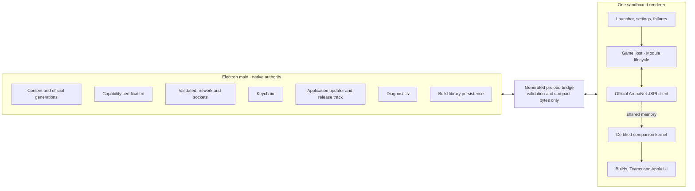
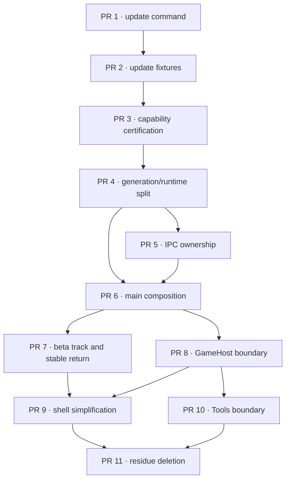

# Full refactor and optimization plan

Status: proposed implementation plan
Date: 2026-08-10
Repository baseline: `cfcdb4c` (`Simplify and strengthen the test architecture (#118)`)
Scope: evolve the current shipped `gwonmac` in place, one independently useful
pull request at a time.

This plan owns the next architectural refactor program. Older plans under
`plans/` remain historical evidence for decisions already made, investigations,
and rejected approaches. They are not instructions to recreate earlier
architectures.

The program has one central constraint:

> Make ArenaNet updates fast and safe first. Simplify the code around that
> proven workflow second. Add no framework merely because several existing
> files are large.

The target is not a new application beside the current one. The target is the
current application, progressively simplified while players continue receiving
ordinary updates through the existing signed update path.

---

## 1. Executive decision

Keep the proven product and runtime architecture:

- Electron with bundled Chromium and JSPI.
- One sandboxed renderer.
- The untouched official ArenaNet client as the canonical fallback.
- Main-process ownership of native authority, storage, network validation,
  Keychain, application updates, and diagnostics.
- Renderer ownership of the Emscripten `Module`, live game state, presentation,
  and Tools UI.
- Content-addressed game chunks and atomic client generation promotion.
- Independent, fail-closed optional client transforms.
- A minimal Rust companion kernel for bounded observations.
- One local `.gwdiag` report and no telemetry.
- Squirrel.Mac and the existing release identity.

Change the parts whose ownership has become difficult to see:

- ArenaNet recertification is currently spread across expert commands, tables,
  evidence, and live procedures.
- Client certification is presented too much as one broad verdict even though
  different capabilities have different trust and degradation rules.
- `ClientRuntime` owns several correct but intertwined responsibilities.
- `ipc.ts`, `main.ts`, `harness.ts`, and `settings.ts` have accumulated more
  workflow than their boundaries should own.
- The Tools feature has a good domain model but a broad UI and host surface that
  should remain independently understandable.
- Several historical plans describe architectures the current repository has
  already surpassed.

Do not start by replacing Electron build tooling, persisted formats, the
updater, the chunk store, the companion, diagnostics, or the release pipeline.
Those systems already carry hard-won invariants and executable evidence.

---

## 2. Definition of the dream end state

When every required PR in this plan has merged, the following statements are
true.

### 2.1 Player experience

1. ArenaNet may publish an unknown game build at any time. The app still starts
   the verified official client.
2. Host-only Builds and Teams remain available on every game build.
3. Template saving, cursor repair, double-click repair, observations, and Apply
   each report their own availability. One refusal cannot disable unrelated
   capabilities.
4. The player sees a calm capability-specific explanation, never a generic
   “Tools failed” state.
5. Existing settings, build libraries, templates, credentials, downloaded game
   data, and window state survive normal application updates.
6. Application-update failure never prevents Guild Wars from starting.
7. The application quits within its existing deadline even when cleanup work
   fails.
8. No new account, game-data, or diagnostic content leaves the machine.
9. Players may opt into public beta application updates without installing a
   second copy of Gwonmac or changing release identity.
10. Leaving the beta track stops future beta offers immediately. A final stable
    release installs through the normal updater; when the latest stable is
    older, the app offers an explicit verified stable download instead of
    attempting a hidden self-downgrade.
11. Public beta releases never make canonical player data unreadable by the
    latest stable release.

### 2.2 Application release experience

The signed release application has one user preference:

```ts
type UpdateTrack = "stable" | "beta";
```

This preference selects eligible application releases. It is not a packaging,
signing, Keychain or storage identity. The existing `release`, `preview` and
`development` distribution channels retain those security responsibilities;
`preview` remains an internal/test package and does not become a second public
beta product.

The selection policy is deliberately small:

| Installed release | Selected track | Eligible releases |
| --- | --- | --- |
| stable | stable | newer stable only |
| stable | beta | newer beta, release candidate or stable |
| beta/RC | beta | later beta, release candidate or final stable |
| beta/RC | stable | stable only; no further prereleases |
| any | any | never alpha |

Betas are prereleases of their intended final version, for example
`2026.9.0-beta.1` → `2026.9.0-rc.1` → `2026.9.0`. Reaching that final stable is
a normal forward update.

macOS automatic update is not treated as a general downgrade mechanism. If a
player selects Stable while running a beta newer than the latest stable, the
app identifies the latest signed stable release, explains the situation, and
offers its verified DMG. It never sends an older version to Squirrel.Mac and
never silently replaces the running application.

Rollback safety is primarily a data-compatibility rule:

- beta settings changes are additive and unknown fields are tolerated;
- beta releases do not destructively migrate canonical player data;
- beta-only caches and indexes are versioned, disposable and rebuildable;
- renames or semantic changes require a stable expand/contract release first;
- credentials retain the release Keychain identity; and
- reinstalling stable never deletes profiles, Builds, Teams, templates,
  diagnostics or downloaded game data.

This is a real compatibility requirement created by the player-facing rollback
promise. It does not justify a generic migration framework, application
snapshots, duplicate update service, background rollback agent or bundled copy
of the previous application.

### 2.3 Patch-day experience

The ordinary maintainer workflow is one command:

```bash
pnpm client:update /absolute/path/to/client-artifacts
```

The command:

1. validates the supplied official artifacts;
2. fingerprints the exact JS and WASM pair;
3. evaluates every capability independently;
4. rebuilds every transform the candidate build permits;
5. validates deterministic output and composition;
6. runs mutation/refusal checks against local fixtures;
7. writes one machine-readable report and one human-readable report;
8. generates candidate source data rather than asking for hand-authored hashes
   or addresses;
9. names the exact live confirmations still required; and
10. refuses to publish or modify production certification by itself.

An ordinary patch therefore becomes:

```text
detect → run one command → review generated evidence → run named live checks
→ merge a small certification PR
```

A difficult ArenaNet change may still require investigation. The improvement is
that the machine identifies which capability and which proof failed instead of
presenting one undifferentiated broken tool chain.

### 2.4 Runtime architecture



The diagram describes ownership, not a mandatory folder template. A feature
gets a new file only when that file has one real owner and permits deletion or
simplification elsewhere.

### 2.5 Sources of truth

| Concept | Canonical owner | Derived or disposable state |
| --- | --- | --- |
| Official client generation | verified published manifest and artifacts | prepared transform cache |
| Candidate health | active generation plus exact health token | renderer presentation state |
| Game image | main-process content-addressed chunk store | renderer byte LRU |
| Download completion | verified chunk residency | progress, rate and ETA |
| Capability support | capability-owned certification record | summary wording in the UI |
| Live game state | renderer-side companion snapshot | Tools view models |
| Builds and teams | main-owned atomic build library | editor drafts and filtered lists |
| Settings | one versioned settings record | form control state |
| Credentials | macOS Data Protection Keychain | short-lived in-memory values |
| App update | the existing `AppUpdater` state | buttons and status copy |
| App update eligibility | one persisted `UpdateTrack` preference plus pure release selection policy | displayed track and rollback guidance |
| Diagnostics | the canonical recorder | report summaries and comparisons |

No PR may create another authoritative copy of one of these concepts.

### 2.6 Maintainer architecture

- `main.ts` sequences owners; it does not implement their workflows.
- `ipc.ts` validates senders and values; it does not decide domain behavior.
- `ClientRuntime` coordinates execution; generation transactions and runtime
  selection are separately testable concepts.
- The renderer has one explicit game-host boundary. UI code does not manipulate
  `Module` or WebAssembly pointers.
- Client capabilities own their evidence, build facts, transforms, refusal
  rules, and tests.
- The Tools UI depends on a narrow host interface and pure domain functions.
- Diagnostics observe features and never become a required path for them.
- There is one normal command for each maintainer job.
- `pnpm check` remains the fast contributor loop and `pnpm verify` remains the
  complete local gate.

### 2.7 Quantitative outcomes

These are ratchets, not invitations to rewrite correct code solely to hit a
number.

| Outcome | End-state target |
| --- | --- |
| Ordinary patch-day entry point | one command |
| Hand-authored output hashes | zero |
| Hand-authored candidate addresses when a locator exists | zero |
| Unknown-build playability | official client starts with optional capabilities refused |
| Capability blast radius | one capability |
| Main composition owner | one file with sequence and lifetime only |
| IPC workflow decisions | zero in the generic registrar |
| UI access to `Module` | only through the game-host implementation |
| Fast local gate | no slower than the current approximately 45-second baseline without evidence |
| Complete local gate | no slower than the current approximately 3m38s baseline without evidence |
| Production runtime dependencies | no new dependency without a measured requirement |
| Persisted format changes during the program | one additive `UpdateTrack` setting; otherwise zero unless a dedicated PR proves necessity |
| Public application update tracks | stable and beta; alpha never public |
| Native automatic downgrade paths | zero |
| Beta rollback data compatibility | latest stable safely opens canonical data produced by public beta |

File size is a diagnostic, not an acceptance criterion. A 500-line parser with
one coherent grammar may be better than six artificial wrappers. A 150-line
registrar that also owns cache deletion, dialogs, and relaunch policy is still
wrong.

---

## 3. Program rules

### 3.1 One PR, one ownership change

Every PR description must contain:

```text
Problem:
Invariant served:
Current owner:
New owner:
Code deleted or simplified:
Persisted-data impact:
Player-visible impact:
Verification:
Overengineering considered and rejected:
```

A PR that only moves files, renames concepts, adds interfaces, or creates
forwarding wrappers does not qualify.

### 3.2 Hard cutovers inside the codebase

- Do not keep old and new implementations selectable at runtime.
- Do not add refactor feature flags.
- Do not write through two persistence paths.
- Do not leave deprecated bridge channels for internal callers.
- Move callers and delete the superseded path in the same PR.
- Preserve a legacy read only when an already released persisted form requires
  it. Read old, write current, and test the transition.

### 3.3 Protect player continuity

Unless a PR explicitly changes one of these contracts and carries a migration
test, it must preserve:

- product name and bundle identifier;
- Application Support root;
- Keychain service, account, access group and secret shapes;
- settings and window-state files;
- content-addressed chunk paths;
- published client manifest and candidate marker;
- build-library format;
- `gw://app` origin;
- Squirrel.Mac update identity; and
- renderer filesystem mount and template directories.

### 3.4 Tests follow the claim

Use the cheapest layer that can prove the behavior:

1. pure unit test for deterministic rules;
2. fixture integration test for disk, network, process, or native boundaries;
3. Electron story for a real process/window/IPC claim;
4. packaged smoke for the shipped artifact;
5. signed test for Keychain and updater authority;
6. real-client artifact test for exact ArenaNet bytes; and
7. deliberate live scenario for behavior no fixture can establish.

Do not add an Electron test for logic a direct unit test proves. Do not add a
source-text policy test when construction can make the invalid state
unrepresentable. Do not call a fixture a live proof.

### 3.5 Performance changes require a question

Every optimization PR must state:

- the observed problem;
- the metric that represents it;
- the baseline;
- the candidate;
- the controlled inputs;
- the acceptable regression bounds; and
- what code is deleted if the candidate wins.

No optimization is accepted because it appears theoretically faster. No
general benchmark framework is built without a pending architectural decision
that needs it.

### 3.6 Stop conditions

Stop and split a PR when any of these occurs:

- it changes a persisted format and runtime architecture together;
- it changes the preload contract and domain behavior together;
- it changes certification facts and the verifier that judges those facts
  without an unchanged oracle;
- it needs more than one temporary compatibility path;
- its tests require broad rewrites unrelated to the ownership change;
- it adds a generic abstraction with only one production implementation;
- it makes `pnpm check` materially slower without catching a demonstrated
  defect class; or
- its rollback instructions cannot name the previous known-good commit.

---

## 4. Ranking model

Each PR is ranked from 1 to 5 across seven criteria. The overall order is a
maintainer judgment, not a synthetic weighted score.

### 4.1 Criteria

| Criterion | 1 | 3 | 5 |
| --- | --- | --- | --- |
| Player value | invisible tidiness | indirect reliability | immediate playability or recovery benefit |
| Patch-day leverage | unrelated | reduces one manual step | transforms the whole update workflow |
| Risk reduction | cosmetic | narrows a known failure | removes a high-impact failure class |
| Maintainability | local readability | clearer owner | major reduction in cross-feature reasoning |
| Effort | less than one day | several focused days | multi-week or broad migration |
| Regression risk | documentation/test-only | bounded runtime seam | boot, login, content or gameplay hot path |
| Overengineering risk | direct deletion | one new concept with several consumers | framework or speculative flexibility pressure |

Effort, regression risk, and overengineering risk are costs: a lower number is
better. Confidence is stated separately in the ranking table.

### 4.2 Ranked PR sequence

| Rank | PR | Player | Patch day | Risk reduction | Maintainability | Effort | Regression | Overengineering | Confidence |
| ---: | --- | ---: | ---: | ---: | ---: | ---: | ---: | ---: | ---: |
| 1 | PR 1 — one ArenaNet update command and report | 4 | 5 | 4 | 4 | 3 | 1 | 1 | 5 |
| 2 | PR 2 — offline update and complete login protocol fixtures | 3 | 4 | 5 | 4 | 3 | 1 | 1 | 4 |
| 3 | PR 3 — capability-owned certification and degradation | 5 | 5 | 5 | 5 | 4 | 4 | 2 | 4 |
| 4 | PR 4 — separate generation transactions from runtime selection | 4 | 4 | 5 | 5 | 4 | 4 | 2 | 4 |
| 5 | PR 5 — feature-owned IPC handlers | 2 | 2 | 4 | 5 | 3 | 3 | 2 | 5 |
| 6 | PR 6 — small main composition root and explicit cancellation | 3 | 3 | 4 | 5 | 3 | 3 | 2 | 5 |
| 7 | PR 7 — public beta track and safe return to stable | 4 | 1 | 4 | 4 | 3 | 3 | 2 | 4 |
| 8 | PR 8 — explicit renderer GameHost boundary | 3 | 3 | 4 | 5 | 4 | 4 | 2 | 4 |
| 9 | PR 9 — simplify launcher/settings presentation | 3 | 1 | 3 | 5 | 4 | 4 | 3 | 3 |
| 10 | PR 10 — simplify the Tools host and delivery boundary | 4 | 3 | 4 | 5 | 4 | 4 | 2 | 4 |
| 11 | PR 11 — remove obsolete architecture and plan residue | 1 | 2 | 2 | 4 | 2 | 1 | 1 | 5 |

PRs 1–4 are the patch-survival foundation. PRs 5–6 simplify main-process
ownership. PR 7 adds the player-facing release policy after the updater has one
clear owner. PRs 8–10 simplify runtime and product delivery after those seams
are stable. PR 11 removes transition residue only after the code makes the old
descriptions false.

### 4.3 Dependency order



PRs may be split into smaller pull requests when a natural hard-cut boundary
exists. They may not be combined merely to finish the program sooner.

---

## 5. PR 1 — One ArenaNet update command and report

### Rank

Priority 1. Highest patch-day leverage, low runtime regression risk, and no
persisted-data change.

### Problem

The repository contains capable certification, recertification, structural
evidence, workspace, qualification, and live scenario tools. The ordinary
maintainer still needs to know which commands to run, in which order, which
tables they affect, and which result is authoritative.

The first simplification is not a new certification engine. It is one direct
entry point over the existing proven functions.

### Desired result

```bash
pnpm client:update /absolute/path/to/client-artifacts
```

The command accepts a directory containing the official artifact family needed
by the current product. It validates required names and rejects missing,
duplicate, unexpected, oversized, unreadable, or internally inconsistent
inputs.

It writes to an explicit output directory beneath ignored developer state, for
example:

```text
out/client-update/<official-fingerprint>/
  report.json
  report.md
  candidates/
```

The output directory is derived from the verified official fingerprint, not a
user-provided build label.

### Report contract

The report has one result per capability:

```ts
type UpdateCapabilityResult = Readonly<{
  capability: CapabilityId;
  status:
    | "unchanged"
    | "verified"
    | "candidate"
    | "live-confirmation-required"
    | "refused";
  inputFingerprint: string;
  outputFingerprint: string | null;
  evidence: readonly EvidenceReference[];
  refusal: UpdateRefusalCode | null;
}>;
```

This is a developer-tool result, not a renderer IPC contract and not a new
runtime state model.

The human report must answer:

- Can the official client run?
- Which host-only features are unaffected?
- Which transforms reproduced exactly?
- Which facts were structurally re-derived?
- Which candidates require live confirmation?
- Which capabilities refused and at what proof step?
- Which exact commands or scenarios remain?
- Which files would a later certification PR change?

### Implementation boundaries

- Reuse existing parser, verifier, transform, hash, and workspace functions.
- Convert command-only scripts into importable functions only where necessary.
- Keep one executable entry point.
- Do not create a generic task graph, plugin runner, job engine, or extension
  registry.
- Do not write production certification tables.
- Do not sign, publish, fetch a remote feed, open a PR, or contact ArenaNet.
- Do not include official client bytes in the report.

### What to delete or simplify

- Delete redundant public script aliases once the new command covers their
  ordinary workflow.
- Keep low-level diagnostic operations available through the same CLI only when
  a refusal report directs the maintainer to them.
- Delete duplicated artifact discovery and fingerprint formatting.
- Replace hand-copied patch-day command lists in documentation with the one
  command and report interpretation.

### Corner cases

- JS and WASM from different ArenaNet generations.
- A directory containing both JSPI and unrelated Asyncify artifacts.
- A one-byte-modified official artifact.
- A prior interrupted report directory.
- Same fingerprint run twice.
- Output directory exists but contains a different report schema.
- A verifier throws an unexpected error after earlier capabilities succeeded.
- One capability refuses while later independent capabilities can still run.
- Paths containing spaces.
- Developer invokes the command from outside the repository root.

The command writes reports atomically. A failed run may leave a clearly named
temporary directory, but never a complete-looking report.

### Verification

- Unit tests for input inventory and stable result ordering.
- Unit tests for every status and refusal code.
- Determinism test: two runs over identical inputs produce byte-identical JSON.
- Failure-isolation test: one capability refusal does not suppress independent
  results.
- Existing certification tests remain unchanged and green.
- `pnpm check`.
- Targeted client-artifact lane against the currently installed certified
  artifact when explicitly supplied.
- `git diff --check`.

### Better after merge

- One documented patch-day entry point.
- One complete artifact-specific report.
- No runtime behavior change.
- Later refactors have an executable oracle: the report must not regress.

### Overengineering rejected

- No watcher service.
- No database of builds.
- No generic fact ledger.
- No web dashboard.
- No automatic publishing.
- No remote execution.
- No extensible pipeline configuration.

---

## 6. PR 2 — Offline update and complete login protocol fixtures

### Rank

Priority 2. High risk reduction with almost no production behavior change.

### Problem

Unit tests can prove parsers and filtering predicates while missing the complete
protocol that lets a player log in or the complete chain that composes several
transforms. `gwnative` v0.1.6 demonstrated this failure mode when individually
defensible credential controls broke the stateful WebGate exchange.

The lesson is to test the protocol. It is not permission to import gwnative's
cookie jar into gwonmac. Current gwonmac deliberately uses a stateless game
proxy and must continue to do so unless live evidence disproves that contract.

### Desired result

An offline fixture suite proves two complete stories:

1. An unknown or changed client is analyzed, optional capabilities refuse as
   needed, and the official client remains selectable.
2. The current saved-login protocol sends the expected bounded login request,
   returns the fixture account response, forwards no cookie state, and emits no
   protected data into diagnostics.

### Client-update fixture design

Fixtures may contain:

- synthetic WebAssembly modules;
- generated structural summaries;
- hashes and sizes of private official artifacts;
- small mutation patches against synthetic modules;
- expected reports; and
- deliberately ambiguous and malformed candidates.

Fixtures must not contain ArenaNet's official JS, WASM, snapshot, manifest
capture, account data, or traffic capture.

Required mutations:

- changed input hash;
- changed function signature;
- missing structural anchor;
- duplicate structural candidate;
- canonical versus padded LEB128 operand;
- shifted data section;
- changed call edge;
- one forbidden output section change; and
- valid unrelated module change that must not invalidate an independent
  capability.

Each mutation must either re-derive correctly or refuse. A clean but wrong
candidate is a test failure.

### Login protocol fixture

The fixture runs the current production route through a local injected
transport:

```text
stored fake Steam token
→ renderer constructs the official login-shaped request
→ gw:// proxy validates route, method, body bound and redirect
→ upstream fixture returns the expected account-shaped response
→ renderer receives only the response the official client requires
```

Assertions:

- `Cookie` is never forwarded upstream.
- `Set-Cookie` is never forwarded downstream.
- The fake token is absent from diagnostic records, renderer failure IPC,
  exported documents, and console-copy surfaces.
- The account identity is absent from diagnostics.
- A redirect escaping the exact allowlisted host refuses.
- An oversized request body refuses before upstream transport.
- The correct second request does not depend on hidden Chromium cookie state.
- The separate Steam OAuth acquisition window retains its existing ephemeral
  in-memory cookie behavior and cleanup tests.

### What to delete or simplify

- Replace disconnected proxy predicate tests only when the complete story
  exercises the same rule with clearer evidence.
- Keep small pure tests for allowlist edge cases that the story does not cover.
- Remove duplicated synthetic artifact builders by introducing one fixture
  builder local to the client-artifact test area, not a repository-wide test
  framework.

### Corner cases

- Expired stored token.
- Explicit login after a stored token failed.
- Malformed XML-shaped response.
- Upstream timeout after request body validation.
- Redirect loop.
- Response body over its declared bound.
- Proxy error after the diagnostic span begins.
- Capability verifier crash after other results were recorded.
- Fixture contamination between tests.

### Verification

- `pnpm test:unit` for pure boundaries.
- `pnpm test:integration` for the injected proxy transport and update report.
- Targeted Electron Steam acquisition story remains green.
- `pnpm test:client-artifact` with an explicitly supplied local artifact.
- Secret canaries planted in token, account, cookie, path and response fields.
- `pnpm check`.

### Better after merge

- Security changes are judged against a working player protocol.
- Patch-day refactors have a deterministic offline corpus.
- The stateless proxy contract is proved rather than merely stated.
- No cookie/session abstraction is added.

### Overengineering rejected

- No protocol-description DSL.
- No generic `ProxyRoute` body/cookie/redirect policy table.
- No recorded production traffic.
- No fake ArenaNet service covering endpoints the tests do not need.
- No real account in ordinary CI.

---

## 7. PR 3 — Capability-owned certification and degradation

### Rank

Priority 3. Highest architectural value, but intentionally follows the report
and fixture oracle because it changes the central certification model.

### Problem

Different capabilities have different evidence and failure rules:

- Builds and Teams are host-only.
- Template saving has structural verification.
- Cursor and double-click are transform-backed repairs.
- Companion observations depend on exact layouts and bounded decoding.
- Apply commands require exact command targets, region policy, explicit player
  intent, and observed confirmation.
- Extended memory is an exact-build research profile, not a production repair.

Treating these as one broad certified/template-only/unsupported verdict makes
maintenance and player degradation coarser than the underlying system.

### Desired result

One capability result is produced for each independently degradable feature:

```ts
type CapabilityStatus = Readonly<{
  availability: "available" | "unavailable";
  reason: CapabilityReason | null;
  build: string | null;
}>;

type ClientCapabilities = Readonly<{
  templateSave: CapabilityStatus;
  nativeDoubleClick: CapabilityStatus;
  nativeCursor: CapabilityStatus;
  partyObservation: CapabilityStatus;
  targetObservation: CapabilityStatus;
  teamCommands: CapabilityStatus;
}>;
```

This is a closed product set, not a plugin registry. Additions require a real
feature and its degradation contract.

Host-only Builds and Teams are not members because their availability is not a
client-certification question.

### Ownership

Each client capability owns:

- input artifact identity;
- build-specific facts;
- locator or exact table;
- structural verifier when one exists;
- transform when one exists;
- deterministic output identity;
- runtime arm/disarm rule;
- refusal codes;
- patch-day evidence; and
- unit, artifact, integration and live proof requirements.

Shared certification composition may answer which derived module to select. It
must not absorb the capability-specific proof logic.

### Implementation sequence

1. Introduce the closed capability result as a derived projection over current
   certification sources.
2. Make the patch-day report consume that projection.
3. Make renderer presentation consume the same projection.
4. Move one capability's facts and verifier beside its owner at a time.
5. Keep transform composition in one explicit ordered function.
6. Delete the broad verdict where no remaining consumer requires it.

If the broad verdict remains useful for one compact player sentence, derive it
from capability results. It cannot remain authoritative.

### What to delete or simplify

- Delete duplicated capability-to-setting and capability-to-copy maps.
- Delete global branches that disable all optional Tools after one independent
  refusal.
- Delete build facts from unrelated modules after their owner moves.
- Delete settings or environment switches that select developer-only
  certification programs in packaged builds.
- Preserve one explicit transform chain rather than adding a general pipeline
  engine.

### Corner cases

- Official client valid, template save valid, observations unknown.
- Passive observations valid, commands refused.
- Cursor requested while its transform is refused.
- Target observation disabled by player setting while party observation remains
  available.
- Unknown region disables commands without claiming certification failed.
- Capability disarmed mid-session.
- Certificate feed proposes a template-save fact but exact command facts do not
  match the shipped table.
- One transform cache is corrupt while official artifacts remain sound.
- A capability's output hash matches but its structural verification fails.

### Verification

- Truth-table tests for every meaningful capability combination.
- Unknown build selects official bytes and publishes independent refusals.
- Host-only build library remains available with every client capability
  unavailable.
- Each transform falls back to its own input, not directly to a global start.
- Existing exact-build artifact tests port with their capability.
- Packaged application cannot enable developer-only capability programs.
- Electron UI story renders mixed availability honestly.
- Live disarm scenario remains scoped to one capability.
- `pnpm verify`.

### Better after merge

- ArenaNet updates break the smallest truthful surface.
- Patch-day reports point at one capability owner.
- Host-only player value survives every unknown build.
- Adding a capability requires evidence and degradation, not registration in a
  generic platform.

### Overengineering rejected

- No universal fact ledger.
- No capability plugin API.
- No dynamic capability discovery.
- No user-authored capability configuration.
- No general transform graph.
- No remote fact authority for unprovable addresses.

---

## 8. PR 4 — Separate generation transactions from runtime selection

### Rank

Priority 4. High safety and maintainability value at a high-risk runtime seam.

### Problem

`ClientRuntime` correctly coordinates update, candidate publication, snapshot
metadata, derived-module preparation, ready state, confirmation, rollback, and
renderer recovery. The behavior is strong, but understanding which state is
durable official-generation authority and which state is a transient runtime
selection requires reading much of the module.

Copying gwnative's combined persisted state would make this worse. Gwonmac is
JSPI-only and must keep official generation health separate from optional
transform health.

### Desired result

Two explicit concepts using the existing persisted format:

```ts
type ClientGenerationToken = Readonly<{
  generation: number;
  fingerprint: string;
}>;

type RuntimeSelection = Readonly<{
  officialFingerprint: string;
  derivedFingerprint: string | null;
  capabilities: ClientCapabilities;
}>;
```

The generation transaction decides:

- what official generation is active;
- whether a candidate is complete and verified;
- whether the previous generation must be retained;
- whether an exact health token may confirm the candidate; and
- how an interrupted publication or failed candidate recovers.

Runtime selection decides:

- which optional transforms are usable;
- which derived artifact is selected;
- which capability set is published; and
- how transform failure falls back without condemning official bytes.

### Implementation sequence

1. Characterize every current `ClientRuntime` transition with direct tests.
2. Extract pure decisions before extracting filesystem operations.
3. Keep `generationLock` as the one authority for operations that move
   generation directories.
4. Extract official-generation transaction operations behind direct functions
   or one concrete owner.
5. Extract runtime selection as a pure or fixture-testable operation.
6. Leave `ClientRuntime` coordinating those two owners and renderer lifetime.
7. Delete duplicated checks from the coordinator.

Do not change the published manifest, candidate marker, directory layout, or
health-token wire shape unless a dedicated migration need is proven.

### Failure injection boundaries

Add injectable failures around existing durable transitions:

- candidate artifacts staged;
- candidate artifacts verified;
- previous generation retained;
- active directory swap begins;
- active directory swap completes;
- published manifest written;
- renderer captures the health token;
- first frame observed;
- gameplay connection observed;
- candidate confirmation begins;
- previous generation retirement begins; and
- renderer-crash rollback begins.

The injection mechanism is test-only and local to the transaction. It is not a
production hook framework.

### What to delete or simplify

- Delete duplicate generation comparisons after one transaction owner exists.
- Delete runtime-selection branches from durable filesystem operations.
- Delete official rollback behavior triggered solely by an optional transform
  failure.
- Delete helper types that merely rename the same token.
- Keep one lock rather than introducing per-stage locks.

### Corner cases

- Crash before any active generation exists.
- Offline launch with a verified active generation.
- Candidate update while renderer recovery begins.
- Stale renderer confirms after a newer generation publishes.
- First frame arrives but no gameplay socket arrives.
- Gameplay socket arrives after renderer loss.
- Derived artifact fails while official candidate is healthy.
- Snapshot metadata changes while executable artifacts do not.
- Candidate marker is corrupt.
- Previous generation is corrupt and cannot become rollback authority.
- Cleanup fails after successful confirmation.

### Verification

- Kill/failure test at every named durable boundary.
- Exact old-or-new state after recovery; never a mixed generation.
- Stale token refusal.
- First frame alone retains rollback.
- Gameplay proof is tied to the same exact token.
- Transform failure falls back within the same official generation.
- Existing on-disk fixtures remain readable.
- Electron renderer-concurrency stories remain green.
- Client-artifact lane remains green.
- `pnpm verify`.

### Better after merge

- Official update safety can be understood without reading transform logic.
- Transform fallback can be changed without touching generation publication.
- Patch-day capability results feed one runtime-selection operation.
- `ClientRuntime` remains a coordinator instead of becoming a generic state
  machine.

### Overengineering rejected

- No new persisted journal unless failure injection proves the current atomic
  format insufficient.
- No nonce added merely because gwnative uses one.
- No generic state-machine library.
- No event sourcing.
- No current/previous/candidate database table.
- No second lock hierarchy.

---

## 9. PR 5 — Feature-owned IPC handlers

### Rank

Priority 5. Strong maintainability improvement after client-state ownership is
clear.

### Problem

The generic IPC module owns sender validation and channel registration, which
is correct. It has also accumulated dialogs, settings actions, destructive
operations, template export, relaunch decisions, and other feature workflows.
That makes every bridge change look like an application-wide change.

### Desired result

The generic registrar owns only:

- canonical channel names;
- sender and frame validation;
- request parsing;
- handler registration and teardown;
- compact binary assertions; and
- translation of known boundary failures.

Feature owners expose direct handler functions:

```ts
registerIpc({
  content,
  client,
  credentials,
  settings,
  updates,
  diagnostics,
  builds,
  system,
});
```

This object is explicit composition, not a dependency-injection container.

### Migration order

Move the least coupled feature first and use it as the pattern:

1. clipboard/system operations;
2. build library and template export;
3. settings;
4. diagnostics export;
5. credentials;
6. app update;
7. content actions; and
8. client/session operations.

Each move includes its parser, direct handler test, IPC registration, and
deletion from the old switch/registrar.

### What to delete or simplify

- Delete feature workflows from `ipc.ts` after migration.
- Delete duplicated parsing between IPC and direct feature APIs.
- Delete forwarding services whose only operation is calling one function.
- Keep one canonical channel registry and generated preload constants.
- Keep domain logic out of preload.

### Corner cases

- Request from a stale renderer.
- Request from a subframe.
- Handler invoked during quit.
- Dialog owner window destroyed before resolution.
- Binary view backed by a larger WASM allocation.
- Cancellation while a handler waits for disk or network.
- Two destructive requests race.
- Feature handler throws an unknown error.

### Verification

- Direct tests for every moved handler.
- Existing sender-validation policy remains unchanged.
- Existing preload behavior and release contract tests remain green.
- One binary-carrying member per operation.
- Producer-side compaction asserted at the actual send path.
- Electron stories for dialogs, destructive confirmation and renderer loss.
- No preload or IPC channel compatibility layer remains.
- `pnpm verify`.

### Better after merge

- A feature change touches its owner and contract, not a thousand-line global
  workflow module.
- IPC failures can be tested without launching Electron when the claim is not
  process-specific.
- Bridge review focuses on authority and values.

### Overengineering rejected

- No generic RPC framework.
- No decorators.
- No reflection or runtime type generation.
- No service locator.
- No abstract base handler.
- No transport-independent adapter layer with only one transport.

---

## 10. PR 6 — Small main composition root and explicit cancellation

### Rank

Priority 6. Simplifies startup, update and shutdown reasoning without changing
the process model.

### Problem

`main.ts` correctly acts as the application composition root but has grown to
include significant sequencing details, recovery branches, cookie cleanup,
updater scheduling, and feature-specific callbacks. Its header promises no
behavior; the implementation now makes that promise difficult to verify.

### Desired result

`main.ts` visibly performs this sequence:

```text
construct paths and durable owners
start diagnostics
recover official client state
register protocol and IPC
create the window
start bounded background checks
bind renderer/client lifetime
bind reverse-order shutdown
```

Concrete feature modules own the details. No `ApplicationService` or lifecycle
framework is introduced.

### Cornerstone pieces

#### Startup coordinator

One direct function receives already constructed owners and sequences them. It
does not construct hidden dependencies and does not persist a general phase
machine.

#### Cancellation

Long-running preparation receives an `AbortSignal` or its existing equivalent:

- manifest and artifact preparation;
- chunk prefetch/full download;
- application update check/download coordination;
- local client verification;
- diagnostics export; and
- renderer recovery waiting on client work.

Cancellation is owned by the lifetime that started the work. Quit cancels all
remaining application work before bounded cleanup.

#### Shutdown

Preserve the existing principles:

- reverse ownership order;
- later cleanup runs even after an earlier failure;
- cleanup failures are recorded by closed code;
- renderer filesystem flush is bounded; and
- the hard quit deadline wins.

### What to delete or simplify

- Delete feature-specific callback construction from `main.ts` after an owner
  accepts direct dependencies.
- Delete duplicate quit flags and cancellation booleans where one lifetime
  signal suffices.
- Delete update scheduling logic outside the existing `AppUpdater` owner and
  its one scheduler.
- Keep direct constructors instead of adding a dependency injection framework.

### Corner cases

- Application quit during first client download.
- Quit during app update check.
- Renderer crash while generation lock is held.
- Window creation failure after protocol registration.
- Diagnostics startup failure.
- Second-instance activation during startup.
- macOS reopen after all windows close.
- Update restart refuses to begin.
- One cleanup step hangs.

### Verification

- Startup story with offline active client.
- Startup story with cold preparation.
- Update failure still reaches the launcher/game path.
- Forced renderer failure recovers once and then presents the bounded failure.
- Quit completes within the existing deadline under injected cleanup failures.
- No orphan download or socket ownership after renderer loss.
- Main process module import boundaries remain green.
- `pnpm verify`.

### Better after merge

- Startup and shutdown order are readable in one place.
- Features own their cancellation.
- Main remains the composition root without becoming an application framework.

### Overengineering rejected

- No lifecycle state-machine library.
- No dependency injection container.
- No general task supervisor.
- No background-job registry.
- No new persistent startup journal.

---

## 11. PR 7 — Public beta track and safe return to stable

### Rank

Priority 7. Direct player value and meaningful recovery benefit, deliberately
scheduled after `AppUpdater` and application lifetime have one clear owner. It
does not block the ArenaNet patch-survival work.

### Problem

The release parser already understands prerelease stages, but stable installs
intentionally do not offer prereleases. The existing distribution-channel
identity also distinguishes release, preview and development packages. Reusing
that packaging identity as a user preference would mix signing/Keychain
authority with release eligibility and create a second public application.

“Enable beta updates” and “rollback” are also different operations. Opting into
newer prereleases is a normal forward update. Returning from a beta to an older
stable application is a downgrade, which the macOS updater must not be assumed
to support. More importantly, replacing the application bundle is safe only if
the latest stable application can still read the player's canonical data.

### Desired result

The signed release app owns one setting:

```ts
type UpdateTrack = "stable" | "beta";
```

`AppUpdater` remains the only owner of discovery, validation, download, ready
state and installation. A pure release-selection function combines the current
version, selected track and validated candidates and returns exactly one of:

```ts
type UpdateDecision =
  | { kind: "none" }
  | { kind: "upgrade"; release: Release }
  | { kind: "manual-stable-return"; release: Release };
```

Only `upgrade` reaches Electron `autoUpdater`. `manual-stable-return` presents a
verified stable download and clear replacement instructions; it is never
reported as an automatic update.

### Cornerstone pieces

#### One eligibility policy

- Stable track accepts stable releases only.
- Beta track accepts beta, release-candidate and stable releases.
- Alpha is never a public option.
- Stable users do not receive prereleases until they explicitly opt in.
- Selecting Stable immediately suppresses further beta/RC offers.
- The final stable corresponding to an installed prerelease is a normal forward
  update.
- Candidate ordering uses the existing release-version semantics; UI code does
  not reimplement it.

#### Keep identity separate from preference

`release`, `preview` and `development` continue to govern bundle identity,
Keychain access and automatic-update authority. `UpdateTrack` only filters
validated releases inside the signed release app. Preview remains available for
internal/package verification and is not advertised as the beta track.

#### Stable-return behavior

When the player selects Stable while running a prerelease:

1. if an eligible final stable is newer, use the normal updater;
2. if the latest stable is older, show its exact version and a
   `Download latest stable…` action;
3. resolve the download only from the validated release metadata already owned
   by `AppUpdater`;
4. open the signed/notarized stable DMG through the existing external-open
   authority; and
5. explain that replacing the application preserves player data.

The app does not silently quit, move application bundles, retain a duplicate
app bundle, invoke private Squirrel APIs or claim the older stable is an
automatic update.

#### Public-beta data compatibility

The rollback promise becomes a release invariant:

- canonical settings remain readable by latest stable; beta additions are
  optional and unknown fields are tolerated;
- beta does not destructively migrate Builds, Teams, templates, profiles,
  credentials, client generations or game content;
- beta-only cache/index state is explicitly versioned and disposable;
- a field rename, changed meaning or destructive migration requires a stable
  expand/contract release before any beta writes the new representation; and
- a public beta release gate exercises stable → beta → stable against a
  disposable profile whenever persisted behavior changed.

This compatibility check belongs at release certification, not in every fast
contributor run. A beta that cannot satisfy it must not promise rollback and
must not be published on the public beta track.

#### Settings presentation contract

The current Settings surface gains only the preference, current version/track,
one-time opt-in confirmation and stable-return state needed for this PR. PR 9
later migrates that already-proven state into the single Vue presentation
without changing its meaning.

### What to delete or simplify

- Replace the hard-coded “stable never sees prerelease” branch with the one
  track-aware release-selection policy.
- Delete any duplicated candidate filtering from the UI or feed construction.
- Do not turn preview distribution metadata into a user setting.
- Do not add another update feed owner, updater state machine or preference
  store.
- Do not retain both old and new release-selection paths after tests pass.

### Corner cases

- Stable install opts into Beta when no beta exists.
- Stable install sees beta, RC and final candidates for the same release line.
- Beta install advances to a later beta, then RC, then final stable.
- Player switches to Stable before a final stable exists.
- Player switches tracks while a check is running or an update is downloaded.
- Automatic checks are disabled while Beta is selected.
- App is offline when the player requests stable return.
- Release metadata contains alpha, malformed, duplicate, unsigned or wrong-arch
  candidates.
- Latest stable asset is missing after metadata discovery.
- A beta crashes after writing disposable derived state.
- Stable is reinstalled over beta with existing Keychain and player data.

Track changes affect the next check. They do not cancel or reinterpret an
already downloaded application update; the UI names that downloaded version
and lets the player install it or defer it. This avoids racing native updater
state with preference changes.

### Verification

- Pure table tests cover every installed-stage/track/candidate-stage
  combination and ordering ties.
- Alpha and malformed candidates are always refused.
- An older stable produces `manual-stable-return` and is never passed to
  Electron `autoUpdater`.
- Auto-update opt-out, offline behavior and update failure still permit play.
- Renderer tests cover opt-in confirmation, current track/version, track
  switching and both stable-return presentations.
- Packaged signed proof covers stable → beta and beta/RC → corresponding final
  stable through the normal updater.
- Release certification covers beta → older stable reinstall with existing
  canonical player data whenever persisted behavior changed.
- Asset validation, signing, notarization and existing updater authority remain
  unchanged.
- `pnpm verify`.

### Better after merge

- Players can choose early application releases without installing a separate
  product.
- Returning to Stable is truthful and predictable on both sides of the version
  boundary.
- Release selection has one pure, testable owner.
- The rollback promise includes the player data that actually matters.
- Preview/development identities remain narrow security and testing concepts.

### Overengineering rejected

- No automatic macOS downgrade implementation.
- No custom installer or private Squirrel integration.
- No side-by-side public Stable and Beta apps.
- No bundled previous application or application snapshot manager.
- No rollback daemon, remote command channel or second updater.
- No alpha/nightly/custom-channel framework.
- No generic schema migration framework; use an explicit stable expand/contract
  release only when a real persisted change requires it.

---

## 12. PR 8 — Explicit renderer GameHost boundary

### Rank

Priority 7. Strong maintainability gain at a high-risk runtime seam, scheduled
after main/client ownership stabilizes.

### Problem

The renderer harness owns several load-bearing responsibilities: launcher
gating, Emscripten `Module`, filesystem restore, graphics, input, sockets,
credentials, diagnostics, client health, optional transforms, companion
installation, Tools integration, and UI state. These responsibilities belong
in one renderer process, but not in one coordinator file.

### Desired result

One concrete game-host boundary:

```ts
interface GameHost {
  prepare(session: ClientSession): Promise<void>;
  start(): Promise<void>;
  stop(reason: GameStopReason): Promise<void>;
  status(): GameHostStatus;
}
```

This interface has one production implementation. It exists to prevent UI code
from manipulating `Module`, not to support interchangeable game engines.

Owned subcomponents remain direct modules:

```text
renderer/game-host/module
renderer/game-host/filesystem
renderer/game-host/graphics
renderer/game-host/input
renderer/game-host/sockets
renderer/game-host/memory
renderer/game-host/companion
```

Create only the directories/files justified by extracted ownership. Do not
move every existing renderer file for visual symmetry.

### Invariants to preserve

- `Module` remains declared with `var` where ArenaNet glue requires it.
- Snapshot metadata is available before glue reads synchronous `fileSize`.
- IDBFS restore, directories and `chdir` complete before releasing the run
  dependency.
- No audio, networking, WebGL or WASM starts behind the launcher.
- Held input is released when focus/native UI/lifecycle requires it.
- All WASM views crossing the bridge are compact.
- Companion state remains in the renderer realm.
- Official bytes remain the fallback for every transform failure.
- Candidate health uses the exact generation token captured before glue load.

### Migration sequence

1. Extract a read-only status projection used by current UI.
2. Extract client preparation and glue selection.
3. Extract filesystem boot barrier.
4. Extract game start/stop lifetime.
5. Move graphics/input/socket installers behind the host.
6. Move companion installation and disposal behind the host.
7. Move Tools integration to consume host-published values.
8. Delete direct `Module` access from presentation modules.
9. Shrink the original harness to renderer composition and remove it if no
   distinct ownership remains.

### What to delete or simplify

- Delete UI-owned boot flags after `GameHostStatus` becomes authoritative.
- Delete duplicate install/dispose sequencing.
- Delete broad renderer globals used only to reach host internals.
- Keep individual performance-sensitive modules direct; do not wrap every
  WebGL or input call in an interface.

### Corner cases

- Start requested twice.
- Stop during `preRun` filesystem restoration.
- Renderer loses focus during held input.
- WebGL context lost during first frame.
- WASM abort before runtime ready.
- Companion refused after official client starts.
- Tools opened before companion state is available.
- Reload after heap warning.
- Game exits while settings or Tools panel is open.

### Verification

- Existing launcher, filesystem, input, graphics, socket, memory and
  enhancement unit tests move with their owner.
- Electron launcher stories.
- Electron input and camera stories.
- Electron client-health and renderer-recovery stories.
- Packaged enhancement runtime.
- Explicit real-client smoke because `Module` and glue ordering changed.
- Focused before/after performance capture only if the extraction changes a hot
  call path.
- `pnpm verify`.

### Better after merge

- Renderer UI can evolve without risking Emscripten lifecycle ordering.
- Game-host changes have one clear test surface.
- The one-renderer architecture remains intact.

### Overengineering rejected

- No second renderer.
- No worker-hosted game runtime.
- No general game-engine interface.
- No message bus inside the renderer.
- No observable state library unless the presentation migration proves one is
  required.
- No Vite/bundler migration in this PR.

---

## 13. PR 9 — Simplify launcher and settings presentation

### Rank

Priority 9. Valuable but deliberately behind runtime ownership and release
policy because UI
rewrites should consume stable state rather than define it.

### Problem

Launcher and settings presentation have accumulated imperative DOM lookup,
visibility, copy, asynchronous operation, compatibility, update, appearance,
and failure handling. Tools already ships Vue, so the application pays the
framework cost while the core shell retains a second presentation model.

The opportunity is to use one UI model, not to build a design system or state
framework.

### Desired result

- Vue renders launcher, settings, update, compatibility, heap warning and
  failure surfaces.
- The plain TypeScript `GameHost` remains outside Vue.
- Vue receives explicit immutable state and emits explicit commands.
- Main remains authoritative for settings and native actions.
- Existing Guild Wars visual language and accessibility behavior remain.

### Migration sequence

This work may be split into two hard-cut PRs if review size demands it:

1. mount the shell and migrate launcher/progress/failure presentation;
2. migrate Settings, update actions and compatibility presentation;
3. delete replaced imperative DOM code and static markup;
4. remove duplicate view-state derivation; and
5. retain the game canvas and GameHost lifecycle unchanged.

Each surface moves once. There is no runtime switch between old and new UI.

### State rules

- Vue state is presentation state, not another settings store.
- Async operation state comes from feature owners or one local operation.
- DOM visibility is never used as domain truth.
- User-facing sentences remain in the renderer.
- Stable error codes remain the identity of failures.
- No component reads WebAssembly memory, `Module`, Node, filesystem paths, or
  Electron APIs directly.

### What to delete or simplify

- Delete replaced element lookup and manual text/hidden/disabled updates.
- Delete duplicate launcher and Settings representations of the same update or
  compatibility state.
- Delete retired theme compatibility code rather than porting it.
- Reuse the existing UI tokens/components where they are genuinely shared.
- Avoid creating a generic component library for one application.

### Corner cases

- 800×600 window.
- Long localized-unaware English error text without truncating the action.
- Keyboard-only navigation.
- Reduced motion and reduced transparency.
- Increased contrast.
- Update state changes while Settings is closed.
- Heap warning appears while Tools is open.
- Client exits while a confirmation dialog is visible.
- Renderer recovers with persisted settings but no stale transient operation.

### Verification

- Pure view-state tests.
- Vue component tests for user actions and accessibility states.
- Existing Electron launcher/settings/Steam/update stories.
- Visual sweep at supported small and ordinary window sizes.
- Keyboard focus and Escape ownership.
- Packaged smoke.
- `pnpm verify`.

### Better after merge

- One presentation system instead of imperative shell plus Vue Tools.
- Settings logic becomes easier to review and test.
- GameHost remains isolated from UI framework lifecycle.

### Overengineering rejected

- No Redux/Pinia/global event bus unless direct component composition becomes
  demonstrably insufficient.
- No generic design-system package.
- No theme engine.
- No animation framework.
- No renderer process split.
- No simultaneous renderer bundling experiment.

---

## 14. PR 10 — Simplify the Tools host and delivery boundary

### Rank

Priority 9. High product and maintainability value, scheduled after the
GameHost and presentation owners exist.

### Problem

The recent Builds and Teams work contains strong pure domain behavior and
invariant tests. It also introduced a large UI surface, demo/native hosts,
embedded/standalone entry points, cross-tree imports, and several large
components/composables. The risk is not that the feature is inherently too
large. The risk is that UI, host integration, persistence, live observation,
and Apply orchestration become difficult to distinguish.

### Desired result

Tools has four visible owners:

1. pure build/team domain;
2. main-owned atomic persistence and native template publication;
3. renderer-owned live party/command port; and
4. Vue presentation.

The UI depends on one narrow concrete port:

```ts
interface ToolsHost {
  loadLibrary(): Promise<LibraryLoad>;
  saveLibrary(library: BuildLibrary): Promise<BuildLibrary>;
  publishBuild(build: Build): Promise<PublishedTemplate>;
  applyTeam(plan: TeamApplyPlan): Promise<TeamApplyResult>;
  readonly party: ReadonlyRef<LiveParty>;
  readonly applyUnavailable: string | null;
}
```

Keep only operations the shipped UI uses. Demo behavior is development-only
and never reachable from the packaged app.

### Simplification sequence

1. Freeze the pure domain API around current invariant tests.
2. Separate editor draft state from canonical library records.
3. Keep Apply preflight/sequence/confirmation in the domain runner.
4. Make renderer integration a courier for observations and certified command
   ports.
5. Split UI components by user decision, not arbitrary line count.
6. Remove fixture behavior from production imports.
7. Evaluate the separate Tools build only after boundaries are clean.

The separate build may remain if it continues to provide cheap isolated
component and browser testing. It is deleted only if a measured hard-cut into
the main renderer removes more build/runtime mismatch than it adds coupling.

### What to delete or simplify

- Delete duplicate library validation in UI code.
- Delete Apply orchestration from Vue components or generic renderer code.
- Delete adapters that only rename the same domain value.
- Delete production fallback to demo data.
- Delete standalone behavior not used for development tests.
- Keep one skill catalogue model and one library model.

### Corner cases

- Damaged one-record library preserves the remaining collection.
- Import remints identities without creating impossible lineage.
- Unknown hero/skill/attribute data refuses narrowly.
- Partially observed live party remains explicitly unavailable.
- Apply loses certification between preflight and first command.
- Apply changes region during execution.
- One command succeeds and the next refuses.
- Roster return value disagrees with observed party.
- Skills disappear from refreshed catalogue.
- Save fails after an editor draft changes.
- Two save requests race.

### Verification

- Existing pure build/team invariant tests remain the primary oracle.
- Deterministic Apply clock remains injected.
- Component tests cover editor decisions, not implementation details.
- Browser Tools stories cover sortable authoring and responsive behavior.
- Embedded Electron smoke covers real host, IPC persistence, drag, close/open,
  focus and Escape.
- Packaged inventory proves demo and developer entry points do not ship.
- Live command scenario remains explicit and opt-in.
- `pnpm verify`.

### Better after merge

- The largest product feature has visible domain, persistence, live and UI
  boundaries.
- ArenaNet update refusal disables Apply/live observation without damaging the
  library.
- Contributors can work on build editing without understanding WebAssembly.

### Overengineering rejected

- No generic repository/service layer.
- No command bus.
- No plugin-capable Tools host.
- No generic undo framework beyond the product's actual reversible actions.
- No normalized client-side database.
- No second canonical build model.

---

## 15. PR 11 — Remove obsolete architecture and plan residue

### Rank

Priority 10. Low runtime risk and intentionally last because documentation must
describe real merged code rather than planned code.

### Problem

The repository contains valuable investigation history and several large plans
whose instructions no longer describe current main. Keeping them all presented
as active guidance makes contribution harder and creates multiple apparent
sources of architectural truth.

### Desired result

- Current behavior remains owned by existing focused documents under `docs/`.
- This plan records the completed migration and points to final owners.
- Historical implementation programs are clearly marked historical or moved
  under an archive location without rewriting their evidence.
- `AGENTS.md` retains only load-bearing constraints and contributor workflow.
- Repeated inventories and stale line references are deleted.
- Policy tests remain only where executable architecture needs a ratchet.

### Required review

For every plan/document, classify it as:

- current contract;
- current operation/runbook;
- investigation evidence;
- completed implementation record; or
- obsolete proposal.

No document is deleted merely because it is old. Wrong hypotheses and measured
investigations remain valuable when clearly classified.

### What to delete or simplify

- Delete stale instructions that tell contributors to resume completed phases.
- Delete duplicated descriptions of the transform chain, update cadence,
  process boundary, or diagnostic guarantees.
- Delete policy tests whose only purpose was compensating for a code shape that
  no longer exists.
- Delete mandatory source-header policy if ownership is now evident through
  modules and tests and the policy adds ceremony without preventing overlap.
- Update this plan from proposed to completed with final PR links and measured
  outcomes.

### Corner cases

- A historical document contains the only record of a failed hypothesis.
- External website or issue links point to a document path.
- A policy test appears redundant but is the only package/security proof.
- A current runbook links into an archived investigation.
- Generated documentation expects the existing path.

### Verification

- Markdown link check.
- Search for superseded names and commands.
- Every current public behavior has one owning document.
- Every retained policy test states the executable property it proves.
- `pnpm check`.
- `pnpm verify` when source/policy files change.

### Better after merge

- A contributor can identify current architecture without reading historical
  programs.
- Investigation evidence remains available.
- Documentation stops acting as a second implementation.

### Overengineering rejected

- No documentation generator.
- No prose-to-test parser.
- No exhaustive function/file inventory.
- No new taxonomy beyond the five document classes above.

---

## 16. Explicitly not planned

These ideas are not forbidden forever. They are excluded from the required PR
sequence because current evidence does not justify their cost.

### 16.1 One bundled renderer artifact

Potential value:

- deletes the source-valid/runtime-missing module class;
- may simplify asset inventory; and
- could unify shell and Tools delivery.

Why not planned now:

- current package-closure tests already guard missing modules;
- ArenaNet's global `Module` and runtime-loaded glue are unusual bundler inputs;
- source maps and diagnostic identity are valuable;
- it does not directly improve patch-day certification; and
- combining it with GameHost or Vue changes would make regressions difficult to
  attribute.

Evidence required before promotion:

- a timeboxed branch boots the fake and real official clients;
- `Module`, dynamic imports, companion and CSP behavior are unchanged;
- packaged inventory becomes strictly simpler;
- source maps remain useful; and
- alternating measurements show no meaningful startup, memory or frame
  regression.

If it wins, it becomes one hard-cut PR that deletes the old emit/serve path.

### 16.2 One global ArenaNet request arbiter

Potential value:

- makes the eight-request conduct ceiling mechanically global; and
- can preserve demand capacity across all work classes.

Why not planned now:

- current topology and shared ceiling may already make overlap impossible;
- crossing renderer/main request ownership could add more coordination than it
  removes; and
- no measurement currently demonstrates a ninth active ArenaNet request.

Evidence required:

- a test or diagnostic capture shows the current architecture can exceed eight
  or starve demand despite the reserved slot; or
- simplifying scheduler ownership deletes more code than the arbiter adds.

Until then, preserve the shared ceiling and its policy test.

### 16.3 Generic fact ledger

Potential value:

- one file appears easier to update.

Why rejected:

- template proof, observation layouts, command targets and research transforms
  have different authority and degradation rules;
- a generic schema becomes a second programming language; and
- one physical file is not the same as one conceptual source of truth.

Use capability-owned facts and one patch-day report instead.

### 16.4 Generic state-machine framework

Potential value:

- uniform state transitions.

Why rejected:

- client generations, runtime selection, app updates, downloads and GameHost
  lifetime have different durable boundaries;
- current invalid states are domain-specific; and
- a shared framework would hide the operations that need careful review.

Use small discriminated unions and direct functions per owner.

### 16.5 Second renderer or worker-hosted client

Potential value:

- shell might survive a game-runtime failure.

Why rejected:

- Emscripten, DOM, JSPI, WebGL, audio, IDBFS, input and overlay composition all
  become cross-context contracts;
- live game state would need another bridge; and
- current bounded whole-renderer recovery already exists.

Prototype only in response to a measured recovery or isolation failure.

### 16.6 Lazy native game filesystem

Potential value:

- could reduce IDBFS restoration memory.

Why rejected now:

- Emscripten filesystem semantics are broad;
- current transient memory evidence does not yet define a safe replacement;
  and
- the upstream 2 GiB heap condition is not proved to be caused by IDBFS.

Treat it as a separate performance research project with a controlled fixture.

### 16.7 Remote deny or remote fact channel expansion

Potential value:

- quicker emergency capability shutdown or recertification.

Why rejected now:

- it introduces signing, distribution, persistence and UI authority;
- exact command/layout facts cannot be made safe by a signature alone; and
- ordinary point releases already provide a reviewed path.

The existing feed may continue only within its current proof and exact-
restatement restrictions. Expansion requires a concrete shipped incident or a
new structural proof.

### 16.8 New database, cache, profile system or background service

No current acceptance criterion requires one. Existing files, atomic writes,
content-addressed chunks, the current profile, and the existing update schedule
remain simpler.

### 16.9 New runtime dependency

A dependency must delete more maintenance and audit surface than it adds and
must solve a measured requirement. Familiarity or convenience alone is not the
criterion.

---

## 17. Cross-program verification matrix

The final merged program must prove these end-to-end properties.

| Property | Primary proof | Supporting proof |
| --- | --- | --- |
| Unknown ArenaNet build remains playable | client-artifact fallback test | live canary on new build |
| Capabilities degrade independently | capability truth-table tests | Electron mixed-status story |
| Official generation is atomic | failure-injection integration suite | renderer concurrency story |
| Stale renderer cannot confirm candidate | exact token test | crash/recovery Electron story |
| Transform failure does not reject official generation | runtime-selection test | packaged enhancement scenario |
| Patch day has one command | CLI integration test | maintainer runbook |
| Update report is deterministic | byte-comparison test | CI artifact comparison |
| Login protocol remains functional and private | synthetic complete exchange | scoped live login gate |
| Binary IPC cannot amplify WASM backing memory | actual send-path assertion | performance fixture |
| Host-only Tools survive client refusal | domain/runtime integration test | Electron Tools story |
| Apply remains explicit, bounded and confirmed | pure runner tests | opt-in live scenario |
| Quit is bounded | injected cleanup Electron story | packaged smoke |
| Package contains only reviewed runtime files | actual ASAR inventory | release asset verification |
| Release assets bind to source | existing release workflow tests | GitHub attestations |
| Diagnostics contain no protected prose | closed schema and detector | planted canaries |
| Stable users never receive prereleases implicitly | release-selection truth table | packaged update check |
| Beta reaches corresponding final stable normally | release-selection and updater integration | signed stable → beta → stable proof |
| Older stable is never sent to native updater | manual-stable-return test | verified DMG action story |
| Public beta preserves stable-readable player data | compatibility fixtures | beta → older stable release certification |

### Required commands by PR class

| PR touches | Minimum local verification |
| --- | --- |
| developer tools only | `pnpm check`, targeted tool tests, `git diff --check` |
| pure core/runtime selection | `pnpm check`, relevant integration and release tests |
| IPC/preload | `pnpm verify` |
| renderer GameHost or UI | `pnpm verify`, targeted visual/Electron stories |
| official client transform | `pnpm verify`, client-artifact lane, scoped live proof |
| packaging/signing/release | `pnpm verify`, signed dry run where authority is available |
| application release selection or update track | `pnpm verify`, release-policy truth table, targeted updater stories |

The PR description records exact observed counts and elapsed times. The plan
does not freeze counts that naturally change as tests are combined or deleted.

---

## 18. Release and rollout strategy

This is an in-place application evolution.

### 18.1 Release groups

Suggested release points:

| Release group | Included PRs | Player-visible reason to release |
| --- | --- | --- |
| Patch-day foundation | PRs 1–3 | faster compatibility response and truthful independent capability state |
| Runtime ownership | PRs 4–6 | safer candidate recovery and more predictable lifecycle |
| Public beta updates | PR 7 | player-controlled early releases and a truthful return-to-stable path |
| Renderer simplification | PRs 8–9 | clearer launcher/settings behavior and lower maintenance risk |
| Tools and cleanup | PRs 10–11 | stronger Tools isolation and simpler contribution surface |

A security or player-facing fix ships immediately and does not wait for a
group boundary.

### 18.2 Data continuity

The program adds only the backward-compatible `UpdateTrack` setting. Public
beta data must remain readable by latest stable as defined in PR 7. If any
other persisted-format change becomes necessary:

1. stop the affected PR;
2. write a dedicated migration proposal;
3. inventory every released source form;
4. read the old form without modifying it;
5. atomically write the new form;
6. retain recovery on interruption;
7. test real fixture upgrades; and
8. never maintain dual writers.

### 18.3 Rollback

Every PR must be revertible at the source level without deleting player data.
If a PR changes a wire or persisted contract, its rollback story belongs in
that PR and may require forward repair rather than an application downgrade.

Player-facing return from a public beta follows PR 7: corresponding final
stable is a normal update; an older stable is an explicit verified DMG install.
This product behavior does not weaken the source-level rollback requirement for
the refactor PRs.

The release process continues packaging the exact tested build. Do not rebuild
between verification and signing.

---

## 19. Program success review

After PR 11, conduct one review against outcomes rather than file counts.

### Patch-day review

- Run `pnpm client:update` against the current certified build.
- Run it against a one-byte mutation.
- Run it against the next real ArenaNet build when available.
- Record elapsed machine time and human time separately.
- Count manual values entered by the maintainer.
- Confirm each refusal names one capability and proof step.

### Architecture review

- Trace official client update from manifest to candidate confirmation.
- Trace one template-save certification.
- Trace one passive observation.
- Trace one Apply request from click to observed confirmation.
- Trace one settings update.
- Trace Stable → Beta selection, release eligibility and native updater handoff.
- Trace Beta → Stable for both a newer final stable and an older manual stable
  return.
- Trace one diagnostic event to export.
- Trace quit during an active download.

Each trace should cross only the boundaries required by its authority.

### Simplicity review

Ask:

- Did the program create a second source of truth?
- Did any forwarding wrapper survive after its migration?
- Did a generic abstraction gain only one implementation?
- Did any old path remain selectable?
- Did test cost increase without a named defect class?
- Did documentation become another inventory of code?
- Can a contributor find the owner of a capability without reading the entire
  application?
- Can a player update normally without migrating or redownloading game data?
- Can a player leave Beta without hidden downgrade behavior or risking
  canonical player data?

Any “yes” answer requires deletion, simplification, or a written reason the
cost is necessary.

### Performance review

Do not claim global improvement from refactoring alone. Compare only paths that
changed:

- patch-day command time and human steps;
- startup phase timing if `ClientRuntime` or main sequencing changed;
- renderer first-frame and frame pacing if GameHost hot paths changed;
- IPC logical/backing bytes if bridge code changed;
- `pnpm check` and `pnpm verify` duration; and
- package size/inventory if UI delivery changed.

Use controlled alternating runs for any before/after product-performance
claim. Preserve raw results and package identities.

---

## 20. Final definition of done

The refactor program is complete only when all of the following are true:

- [ ] `pnpm client:update` is the documented ordinary ArenaNet update workflow.
- [ ] The command emits deterministic capability-specific reports.
- [ ] Offline mutation tests prove correct re-derivation or refusal.
- [ ] A complete synthetic login exchange proves functionality and secrecy.
- [ ] Host-only Builds and Teams remain available on unknown client builds.
- [ ] Client capabilities publish independent availability and reasons.
- [ ] Official generation health is separate from optional runtime selection.
- [ ] Failure injection proves atomic old-or-new generation recovery.
- [ ] The generic IPC registrar owns no feature workflow.
- [ ] Main visibly owns composition and bounded lifetime only.
- [ ] Renderer presentation accesses the game through one concrete GameHost.
- [ ] Launcher and Settings use one presentation model without duplicating
      settings or runtime truth.
- [ ] Tools has clear domain, persistence, live and presentation owners.
- [ ] No new generic ledger, state-machine framework, plugin system, database,
      service layer, or remote authority was introduced.
- [ ] Existing player data and updater identity remain compatible.
- [ ] Signed release builds expose exactly Stable and Beta update tracks;
      Stable remains the default and Alpha is never offered.
- [ ] Update-track preference is separate from release/preview/development
      packaging identity and `AppUpdater` remains the only updater owner.
- [ ] Beta/RC → corresponding final stable uses the normal signed updater.
- [ ] Returning to an older stable uses a verified explicit DMG action and no
      older version reaches Electron `autoUpdater`.
- [ ] Public beta release proof demonstrates that latest stable can safely open
      canonical player data produced by beta.
- [ ] Package inventory, SBOM, signing, notarization, checksums and attestations
      remain intact.
- [ ] `pnpm check` and `pnpm verify` remain within their current practical
      budgets unless a documented safety proof justifies additional cost.
- [ ] Historical plans are clearly classified and no longer appear to be
      current instructions.
- [ ] The final architecture review finds one source of truth for every concept
      listed in section 2.5.

The final measure is not fewer files or newer patterns. It is that an ArenaNet
update, a player failure, and a contributor change each reach one obvious owner
through the shortest correct path.
